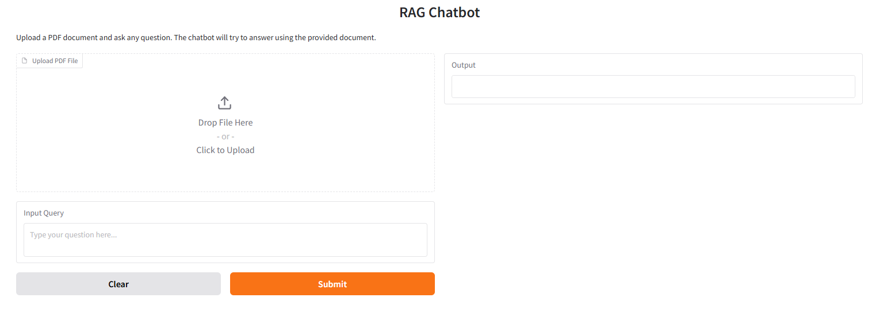
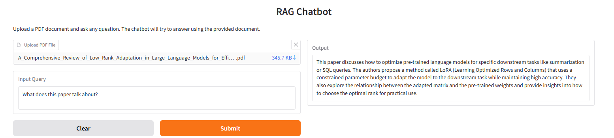
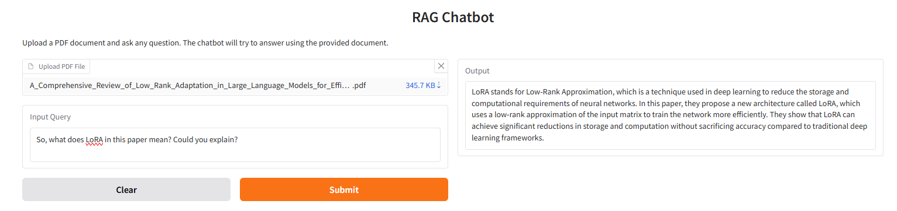

# Interactive RAG QA-bot with LLM-Based Document Reader Using LangChain

[](https://github.com/Shen-po-heng/Interactive-QA-bot-with-LLM-based-Document-Reader-using-Langchain)

## Description
This repository demonstrate a RAG(Retrieval-Augmented Generation) QA-bot with reader can process PDF documents and answer queries based on the content of the documents

⭐ If you found this project useful, consider giving it a star!

### Built with
LangChain, HuggingFace transformers, and Gradio.

## Features
- **PDF Document Upload**: Upload a PDF file, and the chatbot will extract text and split it into manageable chunks.
- **Question-Answering**: Ask any question related to the document, and the model will retrieve the most relevant information to provide an answer.
- **Text Generation**: Built on top of a GPT-based model (e.g., GPT-Neo 2.7B) for natural language understanding and generation.

### UI interface


### Demo Results



### Structure
```
project_root/
├── app.py             # Entry point to run the app
├── config.py          # Configuration settings
├── models/            # Folder for model-related code
│   ├── __init__.py     
│   ├── model_manager.py   # Model initialization and handling
├── services/          # Folder for service-related code
│   ├── __init__.py     
│   └── rag_service.py      # RAG service for document processing and query answering
├── utils/             # Utility functions and helpers
│   ├── __init__.py     
│   └── logger.py          # Logging configuration
└── interfaces/        # Folder for Gradio UI
│   ├── __init__.py     
│   └── gradio_interface.py # Gradio interface setup
└── tests/        # Folder for test
    └── test_rag_service.py 
```

## Getting Started -  Installation and Usage
If you want to play this repo,...

* Step 1: fork this repo, or directly download it (just do as you like)

Remainder: If you are just new to python, remember to set up a <a id=VE href="https://docs.python.org/3/library/venv.html">virtual environment</a> for manage dependencies and keep things tidy. You can check from simple step from <a id = VEsetup href="https://huggingface.co/docs/datasets/en/installation">Hugging face</a>.

* Step 2: Check dependency to install necessary libraries
```bash    
    pip install -r requirements.txt
```
You can install the required dependencies by either using requirements.txt (see below for its contents) or manually installing the following:

transformers
torch
gradio
langchain
langchain_huggingface
langchain_community

* step 3: If everything is ready in your IDE, just execute 
```bash
    python app.py
```
If you want to use specific models, set them up by adjusting parameters in the config.py file. You can modify the model_id and embedding_model_name.

* step 4: Upload a PDF (You can use the one from this repo)
Click on the "Upload PDF File" button in the Gradio interface and upload any PDF file containing the information you want to query.

* step 5: Query the document
You can ask a question related to the document you uploaded, and the chatbot will generate a response based on the content. After uploading the document, type your query in the text box and click the "Submit" button. The chatbot will provide an answer based on the document content.

## Contact
If you have any questions, feel free to ask me.
Also, feel free to open an issue if you encounter any problems. 
I actually plan to enhance this project step by step, so welcome any idea

## Explaination for building QA bot by LangChain
For this project, I currently use <a id=ibmcourse href=https://huggingface.co/TinyLlama/TinyLlama-1.1B-Chat-v1.0>TinyLlama/TinyLlama-1.1B-Chat-v1.0 </a>, which is not too huge for running locally and capable of generating high-quality text as well. I utilize the model in combination with the LangChain framework and Retrieval-Augmented Generation (RAG) to create this repo. Absolutely, I think use a large-scale model will have better result, but this project mainly want to show how to build RAG firsly to assist the pretrained model.

## License
MIT License

## Acknowledge
The paper shown in the demo for this repo is from IBM Developer Skills Network.

